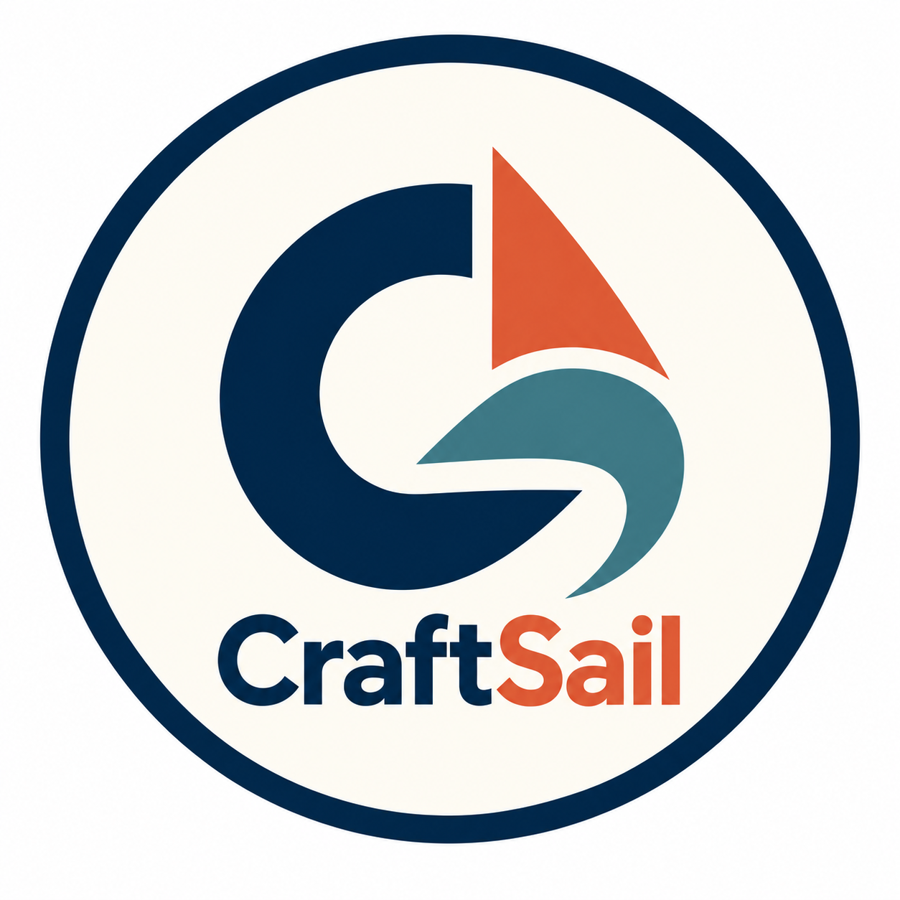

<h1> CraftSail</h1>

<h3>技术很好，运营不行，只是产品死得体面一点</h3>

# CraftSail Book

能做出来，不等于有人找得到、愿意付钱。

同一个功能，你刚做出来，别人很快就能跟上，甚至做得比你好。不加班就卷不过别人，加班又是个无底洞——典型的囚徒困境。

国内高端岗位太少。软件行业在打价格战：加班堆功能、互相压价、功能越做越多、利润越来越薄。你不卷，别人卷；大家都卷，谁也活不好。

要卷，就出去卷。赚海外的剪刀差。

[造物局 CraftSail](https://craftsail.com) 做过的方法，写在这里。能在线上核对的才进目录。

## 为什么写

中国不缺工程师，缺的是买得起好产品、付得起好工资的市场。高端岗位就那么多，剩下的人挤在同一条赛道里：

- 同样的功能，比谁便宜
- 同样的需求，比谁加班更久
- 同样的客户，比谁更不敢涨价

卷到最后，产品没差异，人也不值钱。

海外不是天堂。英语、支付、合规、获客都要重新学。但同一份工程能力，卖给愿意为工具付钱的市场，单价、客单价、利润空间是另一套数字。剪刀差是真的。

别在红海里用功能换生存。把站点、内容和产品做到能被海外用户和机器发现。方法开源，让更多人出去，而不是继续在国内把彼此卷死。

这不是「三个月月入十万」，也不是把国内那套换成英语再打一遍。

## 样本

CraftSail 是面向独立开发者和小团队的 AI / 开发者趋势数据门户。

每一步都应该能在 [craftsail.com](https://craftsail.com) 上打开、用 `curl` 核对。

## 现在可以读

| 章节 | 讲什么 |
| --- | --- |
| [SEO 落地](seo/SEO落地.md) | 独立 URL、真实链接、`<head>`、robots、sitemap、llms.txt；Blog 日更带图表，Help 用带 href 的 sidebar |

## 相关

- 线上样本：[craftsail.com](https://craftsail.com)
- 产品仓库：[github.com/craftsail/craftsail](https://github.com/craftsail/craftsail)
