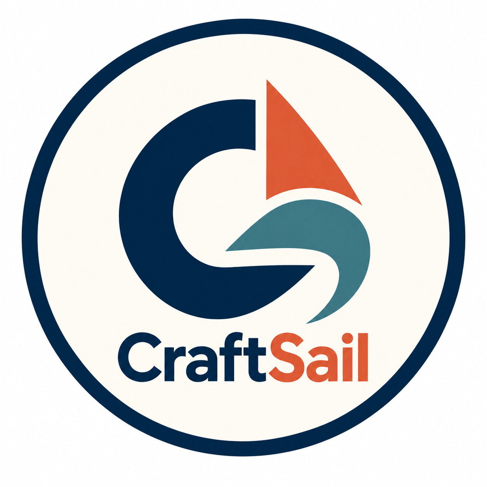

<h1> CraftSail</h1>

<h3>技术很好，运营不行，只是产品死得体面一点</h3>

## 为什么写

能做出来，不等于有人找得到，也不等于有人付钱。

同一个功能，你刚做出来，别人很快就能跟上，甚至做得比你好。不加班就卷不过别人，加班又是个无底洞——典型的囚徒困境。

国内高端岗位少，肯为软件付钱的客户也少。大家挤在一起堆功能、砍价格，利润越来越薄。

要卷，就出去卷。赚海外的剪刀差。

[造物局 CraftSail](https://craftsail.com) 做过的方法，写在这里。能在线上核对的才进目录。

## 样本

CraftSail 是面向独立开发者和小团队的 AI / 开发者趋势数据门户。

每一步都应该能在 [craftsail.com](https://craftsail.com) 上打开、用 `curl` 核对。

## 现在可以读

| 章节 | 讲什么 |
| --- | --- |
| [SEO 落地](seo/SEO落地.md) | 独立 URL、真实链接、`<head>`、robots、sitemap、llms.txt；为什么内容站用 Astro 不用 Next.js；Blog 做成带分页的 feed 流，Help 用带 href 的 sidebar |
| [SEO 的监测](seo/SEO的监测.md) | 用 Search Console、GA4、Cloudflare 看抓取、收录、排名、点击、到站和 AI 流量；CTR 曲线、机会点击、收录时长等公式；每天 / 每周 / 每月的节奏和周报模板 |
| [新站的 SEO 监测](seo/新站的SEO监测.md) | 收录 200–1000 页的新站怎么看 GSC 和 GA4：匿名查询、平均排名、小样本 CTR、GA4 阈值哪些不能信；按 sitemap 看索引率，用 URL Inspection API 每天查全站，算收录时长和展示覆盖率；新站版周报，以及什么时候算过了这一关 |
| [PMF 验证与第一批用户](growth/PMF验证与第一批用户.md) | 刚起步时怎么证明有人真的需要：七级证据链、Mom Test 访谈、手动拉来前 100 个海外 ToC 用户、留存走平、Sean Ellis 40% 调查（带置信区间）、早期定价、PMF 卷宗模板、没过时改哪一层、12 周计划，附参考文献 |
| [工具产品出海运营](growth/工具产品出海运营.md) | 工具类产品从选题到付费的整条链路：选题打分、一句话定位、渠道怎么选、首发清单、激活、留存、定价和收款、分阶段目标、每周实验流程、合规 |
| [工具产品看数据](growth/工具产品看数据.md) | 北极星和指标树、埋点事件表、UTM 规范、渠道质量、激活漏斗、留存队列、MRR 拆分、LTV / CAC、数字掉了怎么查、样本量和置信区间、看板、周报模板、SQL |
| [流量公式与阶段权重](growth/流量公式与阶段权重.md) | 把增长写成公式：Bass 扩散模型拆成「各渠道外部推力 + 口碑内生拉力」，渠道按脉冲 / 线性 / 累积 / 复利四种时间形状建模（残留、饱和、滞后、衰减）；21 个自变量清单、冷启动 / 1→10 / 10→100 三阶段权重表、用自己的数据估权重的方法、可运行的模拟脚本和每个方向的研究路线 |
| [目录站与 awesome 列表](growth/目录站与awesome列表.md) | 早期网站提交目录到底值不值：实测多数「免费 dofollow」其实是 nofollow，Google 把低质量目录和换徽章链接列为链接垃圾；真正的价值是少数目录的引荐、新域名被发现、比较页和 AI 推荐的入选资格；五类目录怎么挑、awesome 列表怎么上和自建、三批提交计划、跟踪表、模型参数 |
| [怎么找社区](growth/怎么找社区.md) | 早期找用户聚集的社区：先列词表，再用六种方法找（搜索运算符、竞品引荐来源、SparkToro、平台内搜索、精选列表、关键词监控）；按发帖数、每帖评论、推广规则打分挑 3–5 个；用 HN 和 Stack Exchange 公开 API 量化话题热度；Reddit / HN / Stack Overflow / Discord 的硬规则；以 CraftSail 为例的实测数据 |
| [冷外联](growth/冷外联.md) | 主动给陌生人发邮件和私信：2026 年回复率基准（平均约 3.4%）、跟进和个性化的效果；小产品该找「放大器」而不是终端用户；联系方式哪些能用（不能抓 GitHub 邮箱）、四段式写法和英文模板；Gmail / Yahoo / Microsoft 发件要求、LinkedIn 和 X 的限制；美国、欧盟、英国、德国、加拿大的法律差异；以 CraftSail 为例的计划 |
| [SEO 术语表](seo/SEO术语表.md) | SEO、GSC、GA4、CTR、LCP、GEO、SSR 等缩写的英文全称和中文解释，按搜索结果页、抓取收录、页面标签、结构化数据、性能、监测、AI 搜索、前端架构分组 |

## 相关

- 线上样本：[craftsail.com](https://craftsail.com)
- 产品仓库：[github.com/craftsail/craftsail](https://github.com/craftsail/craftsail)
