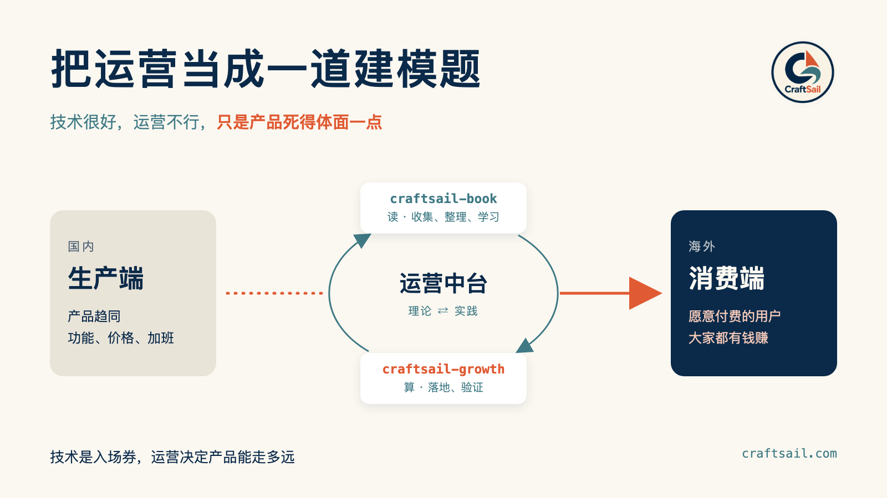

# 把运营当成一道建模题



我常说一句话：技术很好，运营不行，只是产品死得体面一点。

这句话，做技术的朋友听了多半会心一笑，笑完又有点难受。因为很多人都有过这样的经历：花几个月把产品打磨好，上线那天发了一圈朋友圈，然后后台的访问量就停在了个位数。再上网一搜，同一个方向已经有十几个产品，功能差不多，价格一个比一个低。

国内就是这样。生产能力太强，一个新方向刚冒头，很快就挤满了人。大家比功能、比价格、比加班，利润越做越薄。

所以我转向运营，一半是被逼的：产品都趋同了，靠功能拉开差距越来越难，只能去学怎么把东西卖出去；国内卷成这样，只能走出去，去海外找用户。

另一半，是我相信运营这件事，也可以用做技术的方法来解决。这份相信，来自读书时的一段经历。

## 数学建模

读书的时候，我参加过两次数学建模比赛，后来又带人参加过一次。

第一次碰到的题是波粒二象性，第二次是油杆问题，都是和我专业八竿子打不着的陌生领域。拿到题的时候，整个人是懵的，里面的名词得一个个去查。

那几天基本是连轴转：先查资料，弄清楚这个领域的人到底关心什么；再翻论文，看前人用过哪些方法；然后把问题一点点拆开，拆到自己能算为止。4 天 4 夜交卷。第一次拿了全国三等奖，第二次拿了全国一等奖。油杆那次，后来去上海交大做了一次分享，做出来的东西也整理成了一篇论文，发在了核心期刊上。

再后来带人参赛，看他们拿到题也一样发懵，也一样一步步做出来。我就确定了，这靠的是一套笨办法：多看、多拆、多试。

我的导师说过一句话：没读过 800 篇论文，你的论文不会有想法。这句话跟了我很多年。现在看，大模型也是这么回事——先喂进海量语料，能力才会涌现出来。人也一样，看得足够多，判断才会慢慢长出来。

从那以后，碰到陌生的领域，我心里就有底了：名词再生僻，拆到最后，往往就是一道数学题。

运营对我来说，就是下一道陌生的题。

## 技术人做海外运营，是降维打击

说降维打击，我是认真的。

先看运营每天在对付什么：推荐算法、搜索排序、AI 的回答。这些系统，全是工程师写出来的。热度怎么算，标题和标签占多大权重，页面怎么被抓取、怎么被收录，技术人读起来就像读别人的代码。懂规则的人顺着规则做，效率自然高。之前我自己试过三次，就是顺着推荐规则去写、去发，每篇阅读量都过了 3 万。

再看海外。海外获客很大一部分来自 Google 搜索、AI 助手、GitHub、Product Hunt 和 X。robots、sitemap、结构化数据、llms\.txt，说白了都是“怎么让搜索引擎和 AI 认识你的网站”这件事，运营同学要从头学，技术人天天在碰。海外运营这块地，天然适合技术人。

最后是工具。一个运营同学一天能手动查几十个关键词，技术人写一个脚本，可以每天查几千次，还能把结果存下来、画成趋势、算出置信区间（简单说，就是结果可不可靠，心里有数）。经验只能靠一个人慢慢攒，工具写一次，所有人都能用。

技术人要做的，只是在这件事上多花些时间。

## 理论和实践：craftsail\-book 和 craftsail\-growth

既然是一道新题，我就按建模的老办法来：一边学习，一边实践。

学习，放在 [craftsail\-book](https://github.com/craftsail/craftsail-book)。导师说的 800 篇论文，我放到了这里：海外运营相关的资料、文章、案例，我会持续收集进来，整理、消化，再把学到的东西写成笔记。现在已经整理了 SEO 落地、SEO 监测，以及流量公式、找社区、冷外联等增长相关的几篇，这也是我做运营的理论依据。

实践，放在 [craftsail\-growth](https://github.com/craftsail/craftsail-growth)。书里学到、理清楚的方法，最后都落地成这个工具里的功能。它今天刚开源。

现在越来越多人找产品，会直接问 AI：有什么好用的 xxx 工具？AI 回答里提到了谁，用户多半就从里面挑。可对做产品的人来说，AI 怎么介绍你，基本是个黑盒。

craftsail\-growth 就是用来打开这个黑盒的。它帮你回答五个问题：

- **AI 会推荐我吗？** 每天拿目标用户会问的问题，去问 ChatGPT、Claude、Gemini、Perplexity、DeepSeek 这些 AI，看提到你的比例和排名。
- **AI 推荐了谁？** 同一个问题下，哪些竞品被提到，各占多少声量。
- **AI 的依据是什么？** 回答引用了哪些网页，是你自己的站，还是竞品、测评站、社区。
- **我该改什么？** 结合引用来源、站点体检和 Search Console 的数据，给出一份按优先级排好的行动清单。
- **改了有用吗？** 你改完上线，下一轮它会自动复查，用数据告诉你效果。

每天多轮采样、给置信区间、改完自动复查，这些都来自建模时的习惯：结果要多测几次，数字要带上误差，假设要用数据验证。

书里学到的方法，放进工具里验证；工具跑出来的数据，再写回书里。理论和实践就这样来回转，一圈一圈，慢慢把运营中台搭起来。

## 第一道题：流量从哪里来

建模比赛拿到题，第一步是把问题写成公式：要求的是什么，自变量有哪些，它们之间是什么关系。

运营要回答的第一个问题，是用户从哪里来。SEO、社区、KOL、Product Hunt、冷外联、广告、口碑……渠道一大堆，每个都有人说有用。可一个小团队的时间就那么多，不可能样样都做。先做哪个，做到什么程度，什么时候换？

这和当年拿到油杆问题一样：名词很多，先拆。我把它写成了一个公式：

```text
流量 = f(SEO, 社区, KOL, 发布, 外联, 广告, 口碑, ……; 阶段)
```

每个渠道是一个自变量，有自己的权重，权重随阶段变化。刚起步时，靠的是创始人自己去找人；起量以后，SEO 和口碑这些会复利的东西才接手。

下一篇 [流量公式与阶段权重](流量公式与阶段权重.md) 就从这道题开始：先把前人验证过的规律摆出来，就像建模前先读论文；再搭公式、列自变量、给出三个阶段的权重表；最后讲怎么用自己的数据把权重估出来。它也是这本书后面各篇的地图——SEO、社区、目录站、冷外联，每一篇都是在研究这个公式里的一个自变量。

## 一起出海

前些年大家搭技术中台，把登录、支付、数据这些能力沉淀下来，各个产品直接复用。我想做的运营中台也一样：把“让用户找到你、选择你”的能力沉淀下来，变成大家都能用的方法和工具。

这件事需要很多人一起做。800 篇论文，一个人读很慢，一群人分着读就快多了。

运营我也是边学边写，书里难免有写错的地方，欢迎直接指出来。如果你也在做产品、也在想怎么出海，欢迎试试 craftsail\-growth，提 issue、提 PR 都行；也欢迎到 [craftsail\.com](https://craftsail.com) 分享你的发布过程和踩过的坑。

说到底，国内是生产端，海外是消费端。我们最擅长的，是把东西又快又好地做出来。与其挤在生产端互相压价，把彼此卷死，不如把这份生产能力带到消费端去。要卷，就去消费端卷——那里有愿意为软件付钱的用户，大家都有钱赚。

技术是入场券，运营决定产品能走多远。希望我们做的产品，都能走出去，活下来，活得好。

互相学习，共勉。

* 学习地方：https://github.com/craftsail/craftsail-book
* 实践地方：https://github.com/craftsail/craftsail-growth
