> https://www.orbitmedia.com/blog/ga4-seo/

Ranking isn’t really the goal in SEO. Traffic is. That means we need to use GA4 for SEO reporting, because traffic data isn’t in the SEO tools.

Traffic isn’t the ultimate goal in SEO either. Lead generation is. That means we need quality traffic that converts into leads. That also means we need to use GA4, because that’s where our conversion data is.

Welcome to our mini-guide for using Google Analytics to track SEO performance. We’ve outlined seven reports that show how to use GA4 for SEO, showing how you’re doing in Google search, from top-line traffic to bottom-line lead generation.

We’ll keep it simple and stay within the main reporting section. No need for GA4 explorations or custom SEO dashboards in Looker Studio. We’ll do everything using standard metrics and basic filters. No fancy setup required.

How can you check search performance with nothing but GA4 data? Here are the ways…

* 1 Track overall traffic changes from search
* 2 Track search traffic to specific URLs
* 3 Check conversion rates from SEO traffic
* 4 Check conversion rates from SEO traffic to specific URLs*
* 5 Check engagement rates on low ranking pages
* 6 Track visitors who clicked on your Google Business Profile
* 7  Set up email notifications for drops in search traffic

* This one has some super valuable insights

## 1. Use GA4 to track overall traffic from SEO
**Acquisition > traffic acquisition: comparison date range**

First we’ll answer the most basic question: How much traffic does the website get from search? Is total search traffic up or down?

This GA4 report might be the least actionable, but it shows the big picture. It shows all the search traffic to every URL, and with a date range comparison, you can quickly see if the website is going in the right direction.

It’s fast and easy. Just go to Acquisition > Traffic Acquisition, pick a date range and toggle the “Compare” switch. That’s it. Now look at the % change row for “Organic Search” and you’ll see if total search traffic is up or down.
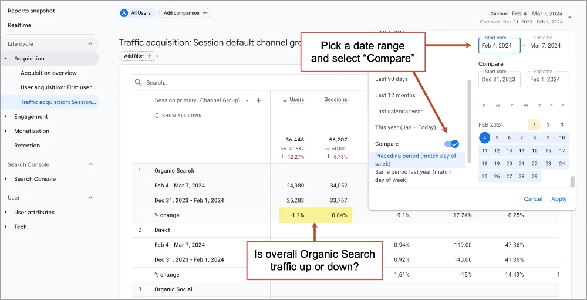

*Caution: Beware of seasonality when picking date ranges. Year over year is better but this makes measurement of recent efforts difficult. Try several date ranges to get the complete picture. And be patient. The impact of SEO changes takes time, often several months.*

It’s a quick check of SEO health, but it doesn’t tell the full story. This number lumps together all search traffic to all pages on the website. It’s the aggregate. In the report above, it looks as if month-over-month search traffic is flat. But search traffic to various URLs may be jumping up or down.

So let’s look at changes to organic traffic in GA4 at the page level. Because the real insights in GA4 are always one level deeper.

## 2. Check search traffic changes to specific pages
**Engagement > Landing page: filtered so session medium exactly matches organic, comparison date range**

Some of your pages are more important than others. Visitors who land on a page about your services are often 10x more likely to become a lead than visitors who start their visit on a blog post. Not all traffic is equal.

If search traffic to your blog rises but search traffic to your homepages falls, GA4 organic search traffic may be up! …and you’d be happy. But in reality, you have fewer qualified visitors …and you shouldn’t be happy at all.

We need to go deeper and check organic search traffic changes per URL. Here’s how:

* Go to Engagement > Landing page
* Use a date range comparison (try previous period and previous year)
* Click “Add filter +” and set the filter to show only traffic from search
      Dimension: “Session medium”
      Match Type “exactly matches”
      Value: “organic”
* Click “Apply”
*Note: other dimensions in filters should give you similar results: Session primary channel group, First user primary channel group, First user medium.*
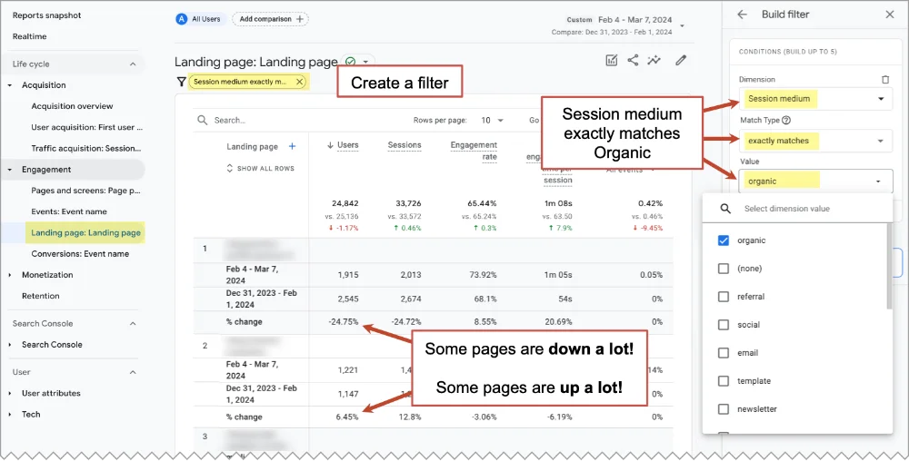
That’s a very useful GA4 SEO report!

You’re now looking at changes from search to each specific page. It will be obvious right away that there are big winners and big losers in any date range. There is a lot of volatility at the page-level which is hidden when you simply look at the overall search traffic.

Now you have more actionable SEO insights.

## When organic traffic to a page is down…
The SEO analysis typically involves the following questions. I’ve listed them in order of probable usefulness, based on my experience.

* Look closely at the content on that page
*Is it missing any answers? Details? What would make it better?*
* Check the phrases for which that page ranks (Google Search Console, Semrush, Ahrefs)
*Do titles, headers and body text align with those phrases?*
* Look for other topically related pages
*Do we have anything that can link to this page?*
* Check demand for that topic (Google Trends)
*Is the traffic drop a seasonal thing?*
* Look at the page speed of that URL (GT Metrix, Google Pagespeed Insights)
*Is something slowing this page down?*
* Search for its phrases and look at the search engine results page (SERP)
*Are you competing with new SERP features?*
Regardless of the diagnosis, the prescription for traffic drops is often the same: on-page SEO edits, internal linking, digital PR and link building and a check of technical SEO factors. But there is nothing you can do about changes to SERPs.

## When organic traffic to a page is up…
Once you’re done celebrating, look for ways to maximize the value of the win.

* Look at the internal links in the content (especially for blog posts)
*Should this article link to anything else? Maybe something with a high conversion rate?*
* Look at the calls to action (“contact” for sales pages, “sign up” for blog posts)
*Is this page guiding visitors toward conversion?*
* Consider the related topics (especially for blog posts)
*Could we write something similar, targeting an adjacent phrase?*

Don’t expect to find keyword data in Google Analytics. For that you’ll need Google Search Console or a paid tool that tracks SEO campaigns. But once you know how to find organic search traffic in Google Analytics, it’s time to move down funnel and check engagement metrics and conversions.

## 3. Check conversion rates from organic search traffic
*Acquisition > traffic acquisition: customized by adding the metric “conversion rate”*

Some SEOs focus only on rankings and traffic. But the best SEOs care about the quality of traffic and conversion rates. They care about leads.

> A smiling man with short hair and a beard, in professional attire, against a blurred background.
> Eli Schwartz, author of Product-Led SEO
> 
> “Actually, you can ignore any data from external SEO tools since SEO success shouldn’t be measured by where you appear on a search results page that a hypothetical user might see if they searched a hoped-for keyword. Keyword visibility only matters if your ideal customer profile clicks those results and lands on your website.“

So let’s head down the funnel together.

To see the overall conversion rate from organic traffic, we can use the same report we used above, but first make sure that the conversion rate is one of the metrics. This means customizing the report to show that metric. Here’s how:

* Go to Acquisition > Traffic acquisition
* Click the pencil in the top right
* In the Customize Report window, click on “Metrics”
* In the “Add metric” box at the end of the list, search for “rate” and select “Session conversion rate”
* Click Apply
*Note: Don’t worry about the date range comparison. Conversion rates by traffic source don’t fluctuate much over time. But check for yourself if you’re curious.*

Now you can see the conversion rate for each channel group. In the example below, I’ve selected my favorite metrics and put them in my favorite order (Users, Sessions, Engagement rate, Avg engagement time, Session conversion rate, conversions).
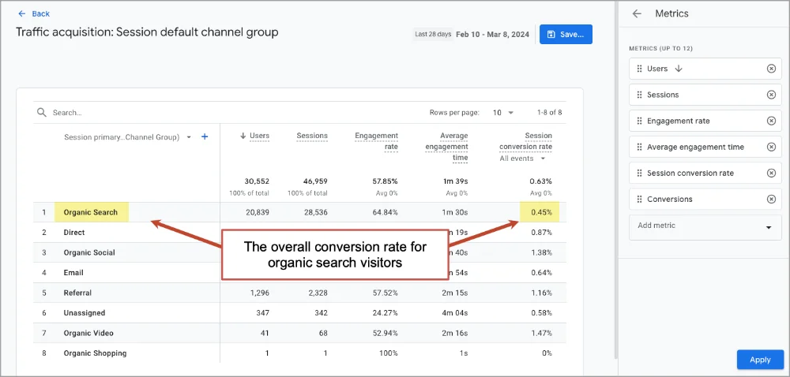

But there’s a problem with this report. It groups together all types of conversions, including contact form submissions (leads) and newsletter signups (subscribers). Both of the two types of visitor intent, commercial and informational, are mixed together.

The overall conversion rate might look high because there are a lot of subscribers, but the site may generate few leads. Or the conversion rate could look low because the site has a ton of blog traffic, but the site actually generates lots of qualified leads. So again, aggregate data is usually misleading.

Let’s go deeper and measure those two types of conversions separately.

## What’s the email signup conversion rate for organic search visitors?

It’s far better to look separately at visitors who have one type of intent and one type of conversion. For example, to see the rate at which organic visitors are subscribing to your newsletter from blog posts, take these two additional steps:

* Click “Add filter +” and set the filter to show only visitors who enter on blog posts (see screenshot below)
     Dimension: “Landing page + query string”
     Match Type “contains”
     Value: “blog”
* Select the email signup conversion type in the dropdown under “Session conversion rate”
*Note: This assumes that all of the blog content is in a common directory (in this case, /blog/) and that conversions are set up properly, of course!*
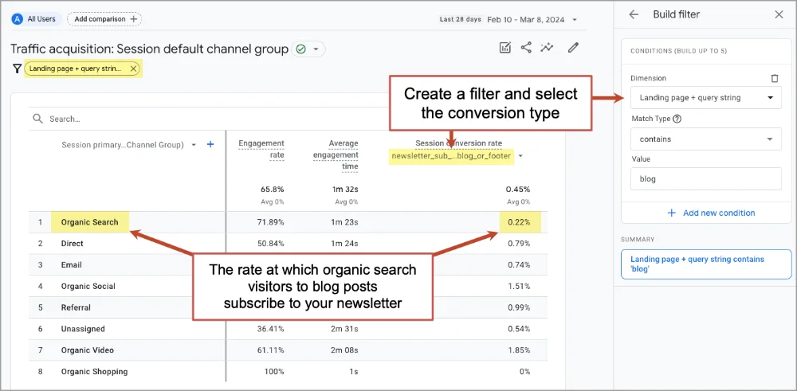
The engagement rate in the report above is also interesting. In this account, organic search visitors who land on blog posts are more engaged than visitors from other traffic sources. It’s 72%, which is far above the average. The average engagement rate is 55%.

## What’s the lead generation conversion rate for organic search visitors?
Let’s move to the bottom of the funnel and check the real ROI of SEO: marketing qualified leads.

But the lead generation rate for search visitors conversion rate is skewed by all of those low-intent blog readers.  Those visitors never had any intent to use our services so we should remove them from the data first.

To exclude the visitors who started their visit on a blog post, change the filter to show visitors who did NOT start on a blog post (Landing page does not contain blog).

Next, select your lead generation conversion event from the dropdown under the “Session conversion rate” metric. You can see in the screenshot below, our conversion event is called “contact_lead” but yours may be named something else.
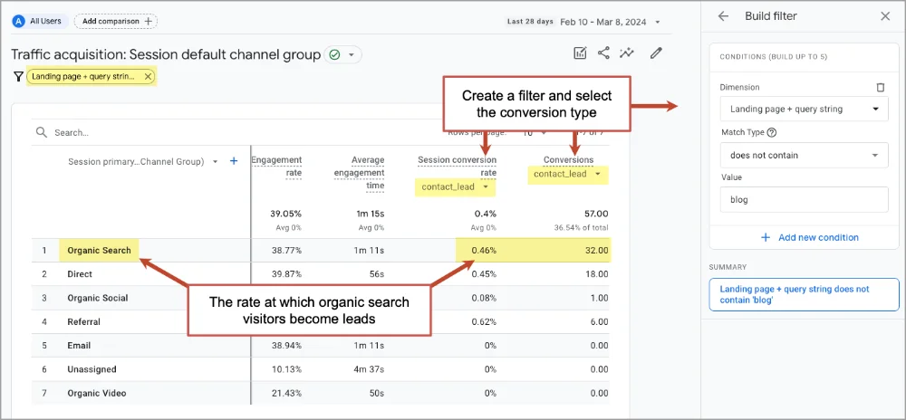

**Caution: GA4 isn’t always inaccurate!**

The report above also shows total conversions, but this number isn’t 100% accurate. GA4 always underreports traffic and conversions. That’s because some visitors don’t accept cookies from the cookie consent banner, they use privacy tools or they’re in incognito mode …or they picked up the phone. Conversion rates are probably fine, but don’t use GA4 to measure total conversions.

To see a more accurate number of conversions, check your CRM, which should be connected to your contact form. Compare those numbers to the numbers in GA4 to estimate the accuracy of your Analytics account. Last we checked, 20% of our conversions weren’t recorded in GA4.

For ecommerce websites, the insights may be even more valuable. Especially if you connect GA4 to the Google Merchant Center. Analytics pro, Brie Anderson, explains:

> Brie Anderson, BEAST Analytics
> “Ecommerce folks – be sure to connect your GA4 property to the Merchant Center. Once linked, you’ll see a channel group called “Organic Shopping.” Then change your default dimension from “channel group” to “session source/medium”. This will break down referral traffic by search engine. Then, add an additional dimension of “session campaign”.
> 
> Using these two dimensions together allows for valuable insights. You’ll be able to see not only which search engines are driving traffic, but also how engaged users are from each source. The secondary “session campaign” dimension further distinguishes Merchant Center’s organic traffic, which is automatically tagged with the “Free Shopping Listings” campaign name.“

## 4. Check conversion rates from organic traffic per landing page
Engagement > Landing page: filtered so session medium exactly matches organic, customized by adding the “conversion rate” metric

SEO is a battle fought page by page. Every keyphrase is a competition and every page is a competitor. But which of your competitors should you focus on? Which pages drive the most impact? What’s the conversion rate for each URL?

Knowing this will help you know where to focus your SEO efforts.

This is really the same report we created in report #2 above, but without the date range comparison and with the conversion rate added. Here’s how to create it:

* Go to Engagement > Landing page
* Click “Add filter +” and set the filter to show only traffic from search (see screenshot below)
      Dimension: “Session medium”
      Match Type “exactly matches”
      Value: “organic”
To see only the visitors who have commercial intent (they didn’t start on a blog post) and converted into an actual lead (rather than the other possible types of conversions) we’ll add a few more steps:

* Create another condition in the filter to show only visitors who didn’t start on a blog post
      Dimension: Landing page
      Match Type: “does not contain”
      Value: “blog”
* Select the lead generation conversion type in the dropdown under “Session conversion rate”

The report should look like this:
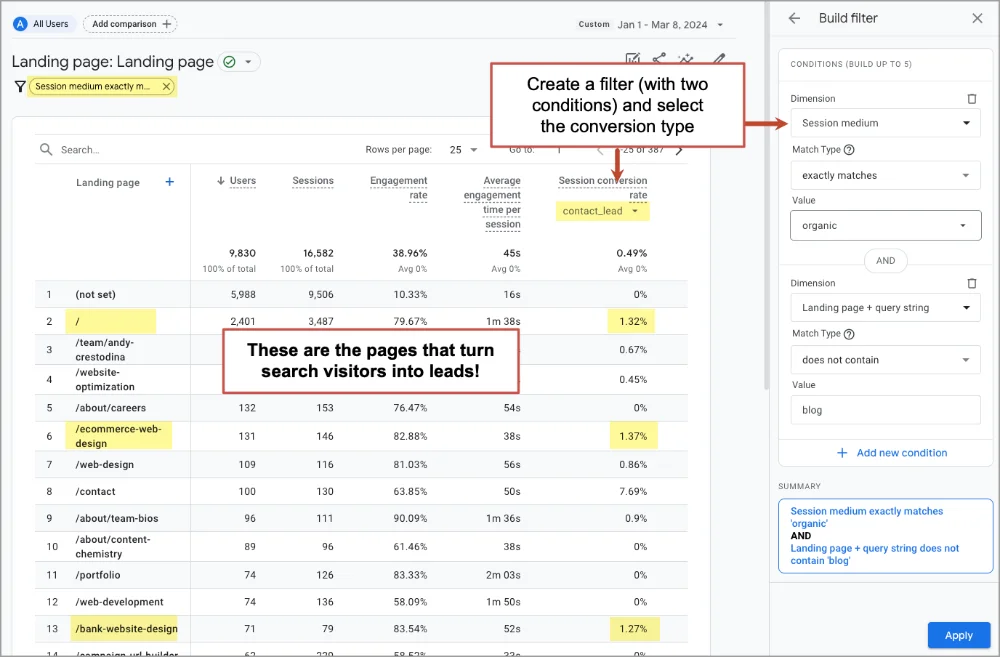
Note: Skip past the contact page. That page really isn’t search optimized anyway. Probably, people land on it after searching for the brand and then clicking on a sitelink. It’s the form. Of course it has a high conversion rate!

Now you can see exactly which pages drive bottom line impact. These are the pages that you should prioritize. Optimize them first. Use every SEO tactic in the book. Give them all the love you can. They’re the ones that fill the sales pipeline.

While you’re at it, take a moment to promote those high performers in other channels.
* If they’re articles, keep promoting them on social media
* If they’re service pages, consider buying a bit of traffic with Google Ads

And of course, it’s never a bad time to do a bit of conversion optimization on the low performers. Here’s our big list of lead generation best practices. There should be at least a few new ideas there.

A few digital marketers say even conversion rates and leads aren’t the best metrics. Marketers should pay close attention to closed deals and new business.

## 5. Check engagement rates of low ranking pages
**Engagement > Landing page: filtered so session medium exactly matches organic**

This page should totally rank. What’s wrong?

The page has lots of detail and keyword relevance. It also has strong Page Authority compared to the other pages that rank for the phrase. It should rank, right? It checks both boxes. It definitely covers the SEO basics.

But maybe the visitors aren’t engaging with the page. Maybe visitors land then quickly hit the back button. Google sees this lack of user engagement as “pogo sticking.” Users are sending a signal that the page is no good and the rankings suffer.
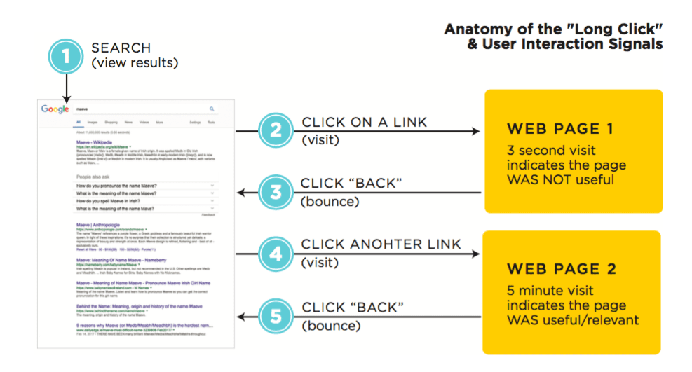

GA4 is the place to check for possible “negative user interaction signals.” If you can’t explain the low rankings in the usual ways, jump into Google Analytics and check the engagement rate. If it’s very low, you may have found the problem.

The report is the same we’ve used above (Landing page filtered so “session medium” matches “organic”) but this time we’re looking for the engagement rate metric.
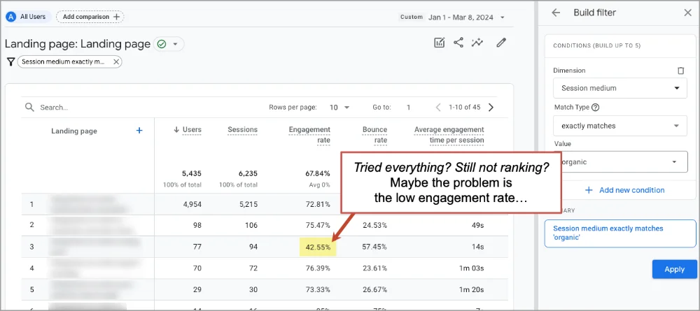
If the engagement rate is low, then user behavior may be sending a signal to google. Google sees that when it sends visitors to this page, they bounce right back to search results quickly. This is known as low “dwell time” (time on page from organic search) which is bad for your rankings, but easy to see in GA4.
There are many user experience best practices that can drive better engagement rates and improve SEO performance.

* Add depth and detail
* Add formatting (subheads, bullets, bolding, etc.)
* Add visuals and video
* Add internal links
Any of these can improve your SEO. They all have strong, indirect impacts on your search rankings.
Hook your visitors quickly! Keep them flowing through your content!

## 6. Track traffic from your Google Business Profile
**Acquisition > Traffic Acquisition: Primary dimension set to “Session campaign”**

Visitors who search for your company name are already brand aware. This searcher has “navigation intent” which means they’re trying to get to your website. They see your website ranking at the top and your Google Business Profile on the right. Did they click on your search listing? Or your business profile? Can you see the difference in GA4?

Yes, you can track visitors who click on the “Website” button in your Google Business Profile, but only if you add a bit of tracking code to that link. The code is technically a set of three parameters (utm_source, utm_medium, utm_campaign) that you add to the end of the link using a URL Builder.

For a link from your Google Business Profile, the source is “google,” the medium is “organic” and the campaign is something like “gbp-chicago” (short for “Google Business Profile Chicago”). It will look something like this, when you set it up using our campaign URL builder.
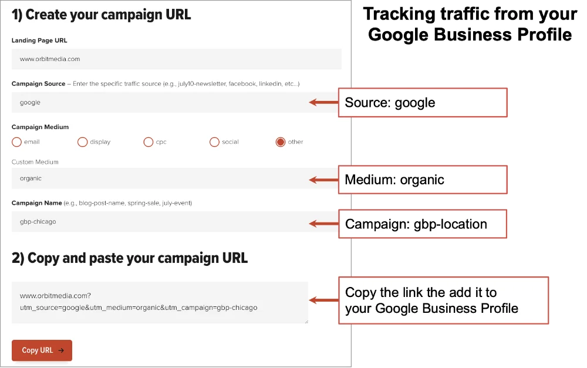
Now use that link, with the three campaign UTM parameters added, as the link to your website from your Google Business Profile. When visitors click that link, GA4 will attribute that click to that button, with the source, medium and campaign name you specified.

You can see them in the Acquisition > Traffic acquisition report. Just change the dimension (using the dropdown at the top of the first column) to “Session campaign.”

In the example below, I’ve used the search tool to show just campaigns with “gmb” in them. You can see that there are business profiles for multiple locations, each with their own campaign name, but only one of the locations is getting any clicks. You can imagine how important this is whenever local SEO is part of an SEO strategy.
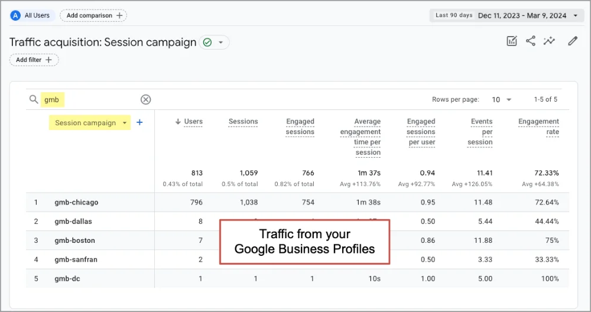

## 7. Get notified of drops in organic search traffic
**Report Snapshot > View all insights > Create custom insight with email notification**

If organic traffic tanks, you may not notice for weeks. Few marketers watch their traffic reports that closely. But GA4 can keep an eye on things for you and send you an email notification if traffic crashes. It’s a “custom insight” with an email notification. Back in the days of Universal Analytics, this was called a “custom alert.”

Here’s how to set up a custom insight that emails you if search traffic drops:

* Go to Reports (the “Reports snapshot”)
* Click on “View all insights →” in the insights card
* Click the “Create” button in the top right
* Click the “Create new” button under “Start from scratch”
* Set “Evaluation frequency” to weekly
* For Segment, rather than “All users” click “Change” and use the following settings to watch for just search traffic.
      Dimension: First user medium
      Match Type: exactly matches
      Value: “organic”
* Set “Comparison period” to Previous week
* For the insight name, use “Organic Search Traffic Drop” or something similar
* Under “Manage notifications” enter your email address
* Click the “Create” button in the top right

Look closely at this screenshot to see what all of the settings look like:
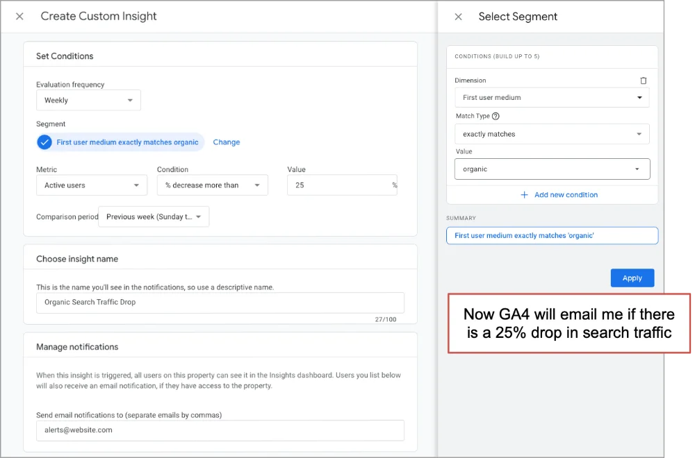
Don’t wait until small problems get big. Let GA4 alert you to issues, then you can jump in and see what’s happening.

* Is it a problem with one or two blockbuster URLs? If so, look at those SERPs and that content.
* Is it a sitewide organic traffic drop? If so, check technical SEO factors and Google algorithm changes.
* Is it a reporting problem with GA4 itself? If so, check Google Tag Manager and cookie consent settings

## Data keeps people accountable
If you’ve hired an agency to do SEO services or an SEO specialist in house, use your Google Analytics 4 data to keep them accountable. Although it’s not famous for SEO metrics, GA4 is an important SEO reporting analytics tool. It’s still the best place to watch traffic and conversion rates.

And it’s a fantastic tool for doing analysis and finding insights. We hope we’ve answered the question: Can Google Analytics be used for SEO? Yes.

Quick recap: We’ve covered seven ways to analyze SEO traffic. But beyond those reports, keep the Google Analytics basics in mind:

* GA4 underreports actual traffic, for privacy and technical reasons. According to our research, our real traffic and conversions are likely 20% greater or more.
* GA4 doesn’t have any keyword data. For that you’ll need to connect Google Search Console to GA4. Or just jump over to GSC.
* GA4 data can be integrated into other tools. A lot of digital marketers connect their tools and then build their SEO reports in Google Sheets. Or pull the data into BigQuery then build SEO dashboards in Looker Studio. That’s what we do.