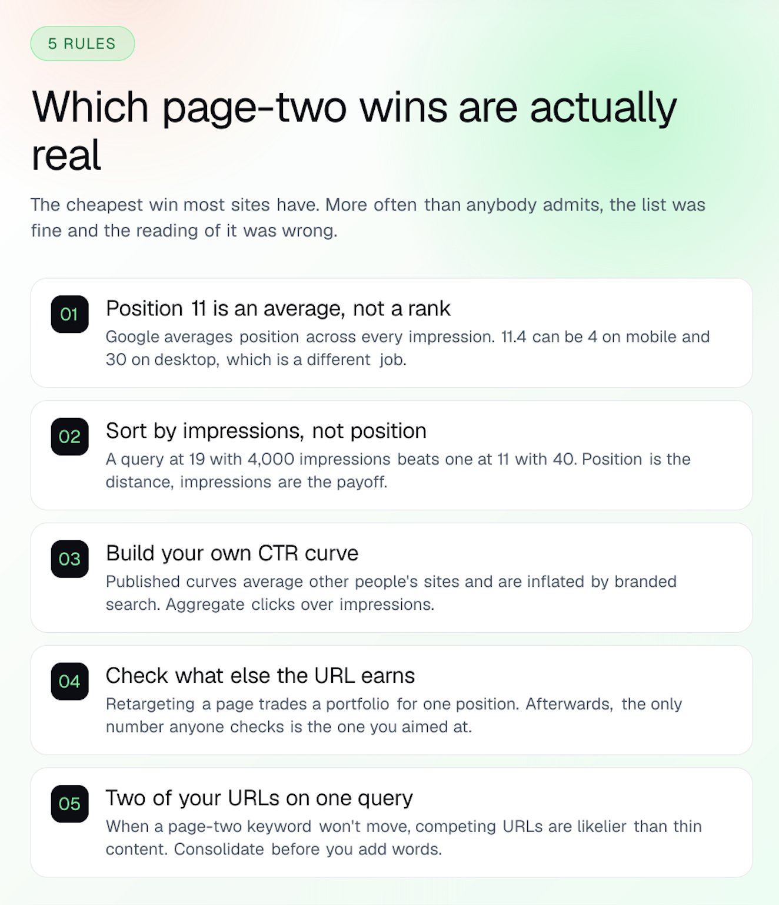

# 临近首页的关键词：哪些第二页排名机会真正值得争取

- **作者：** Reachavo 团队
- **发布日期：** 2026 年 8 月 12 日
- **阅读时长：** 7 分钟
> https://reachavo.com/blog/striking-distance-keywords

你导出了搜索结果第二页的关键词列表：12 个查询词，排名都在第 11 至第 20 位之间。它们对应的页面早已存在，而且都已经获得了展示。你花了一个周末，重写了其中三个关键词对应的页面。六周过去，排名纹丝不动。

这种结果很常见，而“SEO 需要时间”只能解释其中一部分情况。对于大多数网站来说，临近首页的关键词（striking distance keywords）确实是成本最低的增长机会。但有一种情况比大家愿意承认的更普遍：列表本身没问题，问题出在对数据的理解上——首先，你得弄清楚导出文件里的“第 11 位”到底是什么。

本文会说明：平均排名究竟代表什么，如何用自己的点击数据而非别人的图表来评估排名提升的价值，以及哪两种情况下，正确的做法是先别动页面。

## 一张图读懂本文

**哪些第二页排名机会真正值得争取——信息图**

## “第 11 位”究竟意味着什么

Search Console 并不是在告诉你某一次搜索中的实际排名，而是在提供一个平均值。Google 在效果报告文档中对此说得很明确：这个指标会：

> “对所有展示的排名值取平均值（因为链接每次展示时的位置可能不同）。”

这意味着，一个平均排名为 11.4 的查询词，可能对应以下任意一种情况：

- 在移动设备上排第 4，在桌面设备上排第 30。
- 在所选时间范围的前六周排第 8，之后排第 15。
- 在某个国家排第 3，在另一个国家排第 40。
- 在整个时间范围内、所有地区和设备上，确实都排在第 11 或第 12。

只有最后一种，才是大家看到“临近首页”时通常想到的情况。浏览关键词列表时，不妨记住 Google 对这一指标的提醒：

> “排名值是一个复杂的指标；如果不了解其中的细微差别，就可能受到误导。”

因此，这个排名区间只能用来筛选需要进一步查看的候选项，不能直接当作优先级排行榜。如果一个查询词的平均排名 11.4 来自第 4 和第 30 的混合结果，那么它对应的页面未必需要重写——它已经在一种设备上表现出色，却在另一种设备上落后。这是完全不同的问题。

## 如何找到临近首页的关键词

打开效果报告，设置日期范围，并在导出前勾选图表上方的 **“平均排名”（Average position）**。这一指标默认未启用，而整个分析恰恰依赖这一列数据。

使用至少三个月的数据。对于小型网站，28 天的数据通常无法为第二页关键词提供足够的展示量，也就很难区分真实信号与随机波动。最后，你可能只是在给展示次数为一两次的关键词排序。

接下来，按展示次数排序，而不是按排名排序。一个排在第 19 位、获得 4,000 次展示的查询词，比一个排在第 11 位、只有 40 次展示的查询词更值得关注。排名告诉你还有多远，展示次数告诉你这段路值不值得走。

如果你不想手动制作数据透视表，我们的免费临近首页关键词查找工具（striking distance finder）可以直接在浏览器中处理原始导出文件，无需注册账户，文件也不会离开当前页面。

## 花掉一个周末之前，先评估排名提升的价值

接下来很自然会问：从第 14 位升到第 8 位，到底有多大价值？最容易想到的办法，是查一张“排名与点击率对照表”，但这恰恰是应该避免的做法。

所有公开的点击率（CTR）曲线，都是基于其他网站、其他行业和其他查询词计算出的平均值。品牌搜索会大幅抬高曲线头部的点击率，而它们的表现与你正在争取的非品牌关键词完全不同。如果搜索结果页中包含广告、生成式摘要和商品轮播，那么在用户看到自然搜索结果列表之前，大部分点击就已经被分走了。即便同属一个行业，两个网站在相同排名下的点击率也可能相差数倍。

真正能帮助预测你网站流量的曲线，其实已经在这份导出文件里。将查询词的排名四舍五入，按取整后的排名分组，再用每组的总点击次数除以总展示次数。

最后一步比听起来更重要。**不要直接对 CTR 列求平均值。** 如果对每个查询词的点击率取平均，一个只有 3 次展示的查询词，就会和一个拥有 30,000 次展示的查询词占据同样的权重。大量低展示量的长尾查询词叠加起来，甚至会让曲线显示“第 7 位比第 2 位的点击率还高”。正确做法是先汇总点击次数和展示次数，再计算比率。

同时，也要检查每个分组背后有多少数据。对大多数网站来说，曲线到了第 15 位左右就开始失去参考意义，因为后面的展示量不足以支撑可靠的点击率。我们的免费点击率曲线计算器（CTR curve calculator）会完成汇总，并将数据过少、不足以信赖的分组显示为灰色。这类分组通常比人们想象的更多。

用结果做相对比较，不要据此给出精确预测。“在我们的网站上，第 5 位的点击率大约是第 12 位的三倍”，可以作为安排任务优先级的可靠依据。而“这项修改每月会多带来 210 次点击”，则是在层层平均值之上建立预测。

## 哪些页面不该动

这里有一半的问题经常被忽略：临近首页的关键词对应着某个 URL，而这个 URL 几乎不可能只在一个关键词上获得排名。

为了争取这个第二页关键词而重写页面，意味着要修改标题、各级小标题和内容重点。如果这个页面目前已经通过十几个其他搜索词获得流量，那么你就是在用一整组关键词的表现，换取单个关键词的排名。赢下一个关键词，却丢掉另外四个，最终可能得不偿失——但改完后，大家往往只检查当初想提升的那个排名。

所以，动手编辑之前，先查看这个 URL 总共带来了多少自然搜索流量。Organic Keywords（自然搜索关键词）功能会列出页面获得排名的所有关键词，让这件事从凭感觉猜测，变成两分钟就能完成的检查。

一个实用原则是：如果这个临近首页的关键词只占该 URL 现有流量的一小部分，就不要为了它重新调整整页的定位。可以另写一个页面，也可以暂时不动。真正值得重写的，是那些原本就以这个第二页关键词为核心、但表现仍不理想的页面。

## 更可能的问题所在

如果页面本身已经足够好，第二页关键词的排名却迟迟不动，常见原因并不是内容单薄，而是你自己网站上的两个 URL 正在争夺同一个查询词。

这种情况的特征很明显：两个页面都通过同一个查询词获得了可观的展示量，排名都不上不下，谁也没能明显领先。如果一个页面排第 3，另一个排第 47，就不是这种情况——那只是一个页面有排名优势，另一个没有。

排名指标本身还有一个容易掩盖问题的细节。Google 将排名定义为“搜索结果中指向你的媒体资源或页面的链接所占据的最高位置”。因此，在整个媒体资源层面，一个看起来完全正常的排名数字，背后可能隐藏着两个页面争夺展示的情况。

要发现这个问题，需要一份将查询词和页面对应起来的导出数据。但 Search Console 的标准导出并不提供这种对应关系：效果报告会分别给你查询词文件和页面文件，两者之间没有关联。你需要按页面筛选，再逐页导出查询词；或者通过 API 同时获取这两个维度。我们的免费关键词内耗检查工具（cannibalisation checker）可以处理上述任一种数据，展示各个页面如何分摊展示量。

如果确实存在关键词内耗，整合页面通常比继续增加内容更有效：将较弱页面的内容合并到较强页面，并设置重定向，让链接价值和相关性集中到一个页面上。但要先检查每个页面在其他关键词上的表现，原因与上一节相同。

## 什么做法真正能推动排名提升

假设已经确定：这个页面就是合适的目标页面，站内没有其他页面与它竞争，展示量也足以证明值得投入。那么接下来该怎么做？

大多是一些朴实的基本功。打开搜索结果页，观察排名在你前面的页面采用了什么内容形式。如果前五名都是对比表格，而你发布的是一篇长文，那么差距可能不在内容质量，而在呈现形式。检查页面是否回答了查询词提出的具体问题，而不是仅仅回答了写作之初关注的某个相关问题。让页面标题和第一个标题与用户的问题相匹配。再从站内已经讨论同一主题的页面添加内链，指向这个页面。

Google 的《SEO 入门指南》反复强调同一个看似平淡的道理，而且这个道理是对的：你的页面必须提供更好的答案。页面停留在搜索结果第二页，更常见的原因是内容与查询意图略有偏差，而不是少写了两百个词。

## 要点回顾

第 11 位是平均值，不是某次搜索中的实际排名。因此，应把这个排名区间视为需要逐一查看的候选列表，而不是一组即将成功的机会。按展示次数排序。用同一份导出数据构建自己网站的 CTR 曲线，并正确汇总计算，不要照搬别人的对照表。重写页面之前，检查它还通过哪些关键词获得流量。如果同一个查询词对应着站内两个 URL，先诊断这个问题，再着手修改内容。

然后，记录优化前的基线。Search Console 提供的三个月平均值，恰恰不适合用来判断上周的修改是否见效。排名跟踪则会按固定时间安排检查同一组关键词，让你直接看到变化，而不是从平均值中推测。

如果可优化的列表很快就用完了，要记住：临近首页关键词分析，只涵盖你已经获得排名的查询词。对于那些你完全没有覆盖的查询词，需要通过与竞争对手的对比来寻找机会。这也是我们关于关键词差距分析（keyword gap analysis）的文章所讨论的主题。
